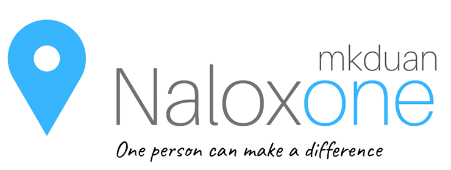

On April 14, 2016, British Columbia’s Provincial Health Officer, Dr. Perry Kendall, declared the opioid crisis a public health emergency in B.C. In 2016, 931 British Columbians died from overdoses – 216 of these overdose deaths were in Vancouver. Fentanyl was detected in approximately 60% of those deaths (Coroners Service, 2017). The crisis is continuing in 2017: by the end of March there had already been 347 overdose deaths in B.C. As high as these numbers are, there is evidence that overdoses are under-reported. Overdose fatalities are now the leading cause of unnatural deaths in B.C., and are increasing nationally as the spread of opioid analogues moves east from Western Canada.
###### Verbatim from [Vancouver Police Department's Review and Recommendations for the Opioid Crisis](https://mkduan.github.io/assets/opioid-crisis.pdf) ######

Naloxone (also known as Narcan®) is a medication called an “opioid antagonist” used to counter the effects of opioid overdose, for example morphine and heroin overdose. Specifically, naloxone is used in opioid overdoses to counteract life-threatening depression of the central nervous system and respiratory system, allowing an overdose victim to breathe normally.

Naloxone is a cross platform application made to combat the opioid crisis. The idea behind this project is to get Naloxone as quickly as possible to overdosed patients by locating the closest hospitals, pharamcies and Naloxone kit holders with the hopes of increasing their chances of survival.

## Features ##

### Login Authentication (in progress) ###
Login Authentication that includes Google, Facebook Authentication, and Email sign up. Google Authentication works, the rest is coming soon!

  

### Map ###
The map in the application shows the user as well as pharmacies and hospitals within a two kilometer radius. When the user taps on a pharmacy or a hospital icon, the location's information will appear above the location. When the user taps on the location's details, a map application on the device will pop up with directions to the pharmacy/hospital from the user's location.

  

### Distress Call ###
This feature of the application allows the user in distress to send out a distress call to nearby users with Naloxone kits so that Naloxone can be administered as soon as possible. The specifics of this feature is described in the following:

#### 1. Sending Distress Call ####
The distress call section within the app has a slide button that allows the user to send out a distress call to nearby users with Naloxone kits within a kilometer radius. The reason why a the limit is a kilometer is because it takes around six minutes for a responder to reached the distressed user at average jogging speed while it takes the ambulance an average of eight minutes to respond to a call (With sirens and lights). The notification by the distress call will include the distance it would take to reach the user in distress.

  

#### 2. Handling the Distress Call ####
Users of this app have options to specify if they are Naloxone kit holders in the settings. Users that are Naloxone kit holders have the additional option of specifying if they want notifications at that specific time. Only users who declare themselves to be Naloxone kits holders that want notifications will receive notifications and are still logged in the app. Only the first responder of the distress call will be designated as the responder to the distress call. The rest will be notified that someone else is responding to the call.

##### 2-a. Responding to the Distress First #####
The notification will indicate the distance from the distressed user and the responder. If the responder happens to be the first responder to the distress call then an alert will notify the responder the distressed user will be notified that they are on the way. As well, a map will open with the location of the user in distress with directions to get there.

  

##### 2-b. Responding to the Distress Following #####
The notification will indicate the distance from the distressed user and the responder. If the responder happens not to be the first responder to the distress call then an alert will notify them that they are not needed in this situation and  the user will be directed to the Map page of the Naloxone application.

  

##### 2-c. Rejecting to the Distress Call #####
The notification will indicate the distance from the distressed user and the responder. If the responder chooses not to respond to the distress call then the user will be directed to the Map page of the Naloxone application.

  

#### 3. Confirmation of the Distress Call ####
When a user decides to respond to the distress call, a notification will be sent to the user in distress so that they know to stay put while help comes. Plans to give the distress user the option to cancel the distress call, but that's still in progress.

  

### Educate ###
This section of the application helps educate the users about the opioid crisis, laws to protect them, how to use Naloxone and other information to combat the opioid crisis.

  

### Settings ###
The settings screen allows the user to declare if they are Naloxone kit holders or not. If they are Naloxone kit holders, they can specify whether they currently want notifications. As well, this is where the user can log out of the application and not receive any notification regardless of their preference.

  

